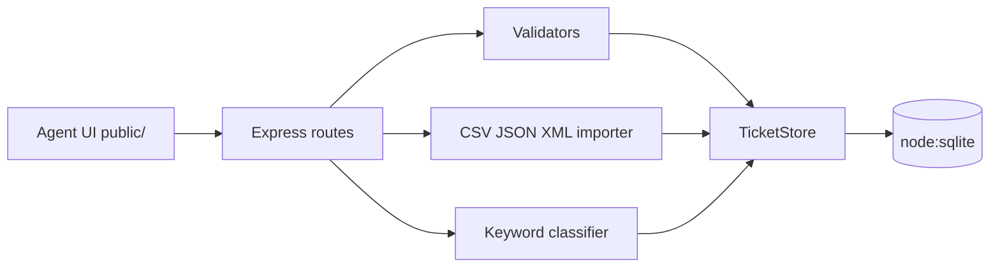

# Intelligent Customer Support System

> **Student Name**: Simone Benevelli  
> **Date Submitted**: 21 September 2026  
> **AI Tools Used**: Cursor (Grok 4.6) — Context-Model-Prompt log in [`docs/ai-usage.md`](docs/ai-usage.md)

A support-ticket API plus an agent web UI: multi-format import (CSV / JSON / XML), rule-based auto-classification, SQLite persistence, and a same-origin front-end.

```bash
cd gen-ai-software-engineering/homework-2
npm install
PORT=3456 ./demo/run.sh        # http://localhost:3456  (API + UI; 3000 is often busy)
npm test                       # 57 tests
```

Full run instructions: [`HOWTORUN.md`](HOWTORUN.md) ·
API: [`docs/API_REFERENCE.md`](docs/API_REFERENCE.md) ·
Architecture: [`docs/ARCHITECTURE.md`](docs/ARCHITECTURE.md) ·
Testing: [`docs/TESTING_GUIDE.md`](docs/TESTING_GUIDE.md)

---

## What is implemented

### Task 1 — Multi-format ticket import API

| Method | Endpoint | Status |
|---|---|---|
| `POST` | `/tickets` | ✅ `201` + `Location`, UUID, optional `?auto_classify=true` |
| `POST` | `/tickets/import` | ✅ CSV / JSON / XML (raw body or `multipart` field `file`) |
| `GET` | `/tickets` | ✅ filters: `category`, `priority`, `status`, `customer_id`, `assigned_to`, `q` |
| `GET` | `/tickets/:id` | ✅ includes classification + decision log |
| `PUT` | `/tickets/:id` | ✅ manual override of category/priority is logged |
| `DELETE` | `/tickets/:id` | ✅ `204` |

Validation covers email format, subject 1–200, description 10–2000, and every enum. Bulk import returns `{ total, successful, failed, errors, tickets }` and keeps going after a bad row. Malformed files return `400`.

### Task 2 — Auto-classification

Deterministic keyword engine (not an LLM) matching the lists in `TASKS.md`. `POST /tickets/:id/auto-classify` returns category, priority, confidence (0–1), reasoning, and `keywords_found`. The same engine can run on create/import via `auto_classify`. Every decision is appended to `classification_log`.

### Tasks 3 & 6 — Tests

56 tests across the eight required suites, **91.27% line coverage**. Integration covers the full lifecycle, import+classify, combined filters, and 25 concurrent creates.

### Task 5 — Front-end

Vanilla HTML/CSS/JS in `public/`, served by Express. List + filters, create/edit with client-side validation, details (classification + metadata), bulk file import, auto-classify, and success/error banners. Layout stacks on small screens.

---

## Architecture



Storage is a SQLite file at `data/tickets.db` (in-memory in tests). There is no authentication.

---

## Project structure

```
homework-2/
├── README.md
├── HOWTORUN.md
├── TASKS.md
├── package.json
├── public/                 # agent UI
├── src/                    # API
├── tests/                  # 8 suites + fixtures
├── demo/                   # run.sh + sample + invalid files
└── docs/                   # API, architecture, testing, CMP log
```

---

## How this used the Context-Model-Prompt framework

Each generation step named three things: **who/what the model should know** (Context), **which model and why** (Model), and **the instruction** (Prompt). The full log, including where generated code was wrong and how it was verified, is in [`docs/ai-usage.md`](docs/ai-usage.md).

---

*This project was completed as part of the AI-Assisted Development course.*
