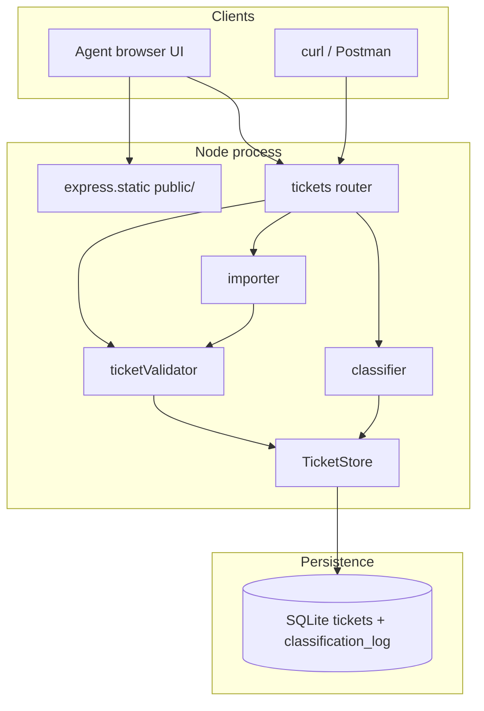
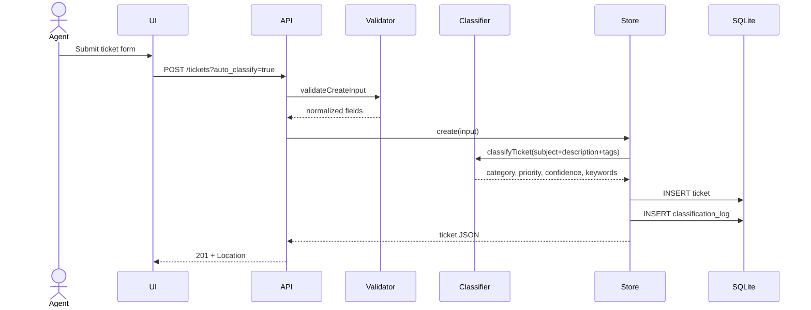
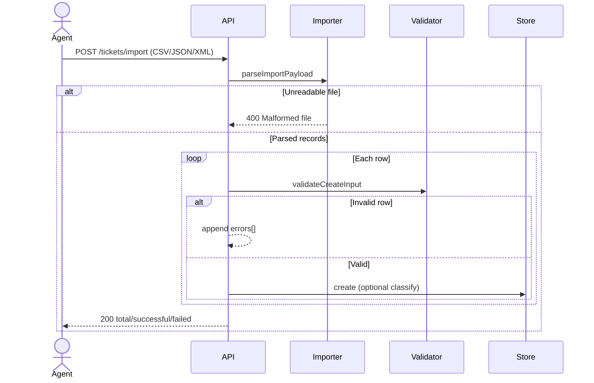

# Architecture

For technical leads. This is a small Express app with one SQLite file and a static agent UI. The interesting decisions are where classification lives, how import fails, and why SQLite instead of the in-memory store from homework 1.

---

## High-level

`createApp({ store })` is a factory so tests open an isolated `:memory:` database per file.

---

## Components

| Component | Responsibility |
|---|---|
| `src/app.js` | Middleware order, `/health`, `/api`, static UI |
| `src/routes/tickets.js` | HTTP mapping, import body (raw vs multipart) |
| `src/validators/ticketValidator.js` | All field/enum/email/length rules; collect every error |
| `src/services/importer.js` | CSV / JSON / XML → row objects; malformed file → 400 |
| `src/services/classifier.js` | Keyword scores → category, priority, confidence, reasoning |
| `src/stores/ticketStore.js` | CRUD, list filters, decision log, `resolved_at` |
| `src/db.js` | Schema + `node:sqlite` DatabaseSync |
| `public/` | Agent UI; no hardcoded tickets |

---

## Data flow: create with auto-classify

## Data flow: bulk import

---

## Design decisions

### 1. SQLite via `node:sqlite` instead of an extra native addon

Homework 1 was in-memory. This assignment needs persistence across UI demos and import retries. Node 22.5+ ships `DatabaseSync`. That avoids `better-sqlite3` compile steps on student machines. Tests still use `:memory:` so they never share a file.

**Trade-off:** the module is experimental (Node prints a warning). Schema is tiny; migrating later is one file.

### 2. Keyword classifier, not an LLM

`TASKS.md` lists exact urgency phrases and category hints, and the classify response must include `keywords_found`. A rule engine is deterministic, free, and testable. Confidence is a function of hit count, not a model score.

**Trade-off:** “I am locked out of SSO” may miss `account_access` if none of the listed phrases appear. That is acceptable for the assignment; override + log covers the miss.

### 3. Import never aborts the batch on a bad row

A 50-row CSV with one bad email still loads 49 tickets. Only *parse* failures (broken JSON, empty body, XML without `<ticket>`) fail the whole request. That matches “failed with error details”.

### 4. Same origin UI, no SPA build

Vanilla files from `express.static` mean `./demo/run.sh` is the whole demo. CORS, Vite, and a second port would be extra failure modes for screenshots.

### 5. Classification log is append-only

Auto-create, auto-import, auto-endpoint, and manual PUT all insert a row. The ticket’s current category/priority is the latest state; the log is the audit trail the assignment asked for.

---

## Security and performance

| Topic | Approach |
|---|---|
| Auth | None. Local coursework API. |
| Body size | JSON 1mb; import 5mb |
| XSS | UI escapes text with `escapeHtml` |
| SQL | Parameterized statements only |
| Concurrency | Node single-threaded + sync SQLite; 25 parallel POSTs succeed in tests in well under 3s |
| Indexes | `status`, `category`, `priority`, log `ticket_id` |

---

## What was deliberately left out

URL versioning, API keys, pagination, webhooks, and an LLM classifier. They would pad the API beyond `TASKS.md` without helping coverage or the CMP write-up.
