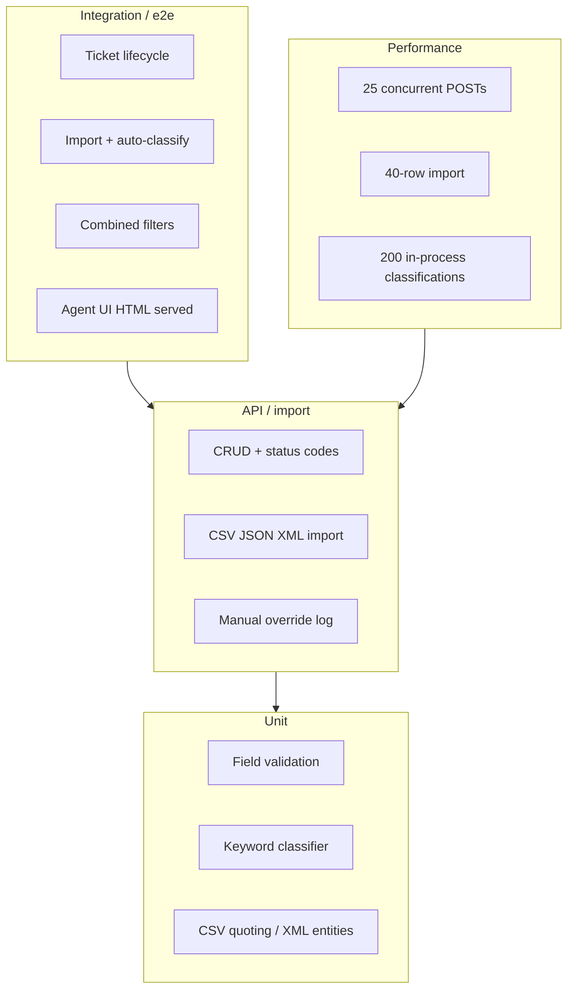

# Testing guide

For QA. How to run the suite, what it covers, where fixtures live, and what to click in the UI.

---

## Test pyramid



Most tests are HTTP against an ephemeral server and an in-memory SQLite. Classifier and parsers are also called directly.

---

## How to run

From `homework-2/`:

```bash
npm test
npm run test:coverage
```

`LOG_LEVEL=silent` is set in the npm scripts so request logs do not drown assertions.

**Last run:** 57 passing, **91.27%** line coverage, **91.67%** function coverage. Branch coverage is lower (~82%) because some validator branches (empty required fields already covered on create, unused metadata parses) are defensive.

Screenshot for submission: `docs/screenshots/test_coverage.png`.

---

## Suites (required files)

| File | Audience | Count | What it pins |
|---|---|---|---|
| `tests/test_ticket_api.test.js` | API | 12 | 201/404/204, filters, auto-classify endpoint, `/api` + `/health`, unknown route |
| `tests/test_ticket_model.test.js` | Validation | 9 | email, lengths, enums, tags, metadata, update |
| `tests/test_import_csv.test.js` | CSV | 6 | header parse, quoted commas, multipart, partial failure, empty file |
| `tests/test_import_json.test.js` | JSON | 5 | array vs `{tickets}`, malformed, wrong shape |
| `tests/test_import_xml.test.js` | XML | 5 | tags, entities, valid import, missing tickets, empty body |
| `tests/test_categorization.test.js` | Classifier | 10 | each category + urgent/high/low/other + confidence |
| `tests/test_integration.test.js` | Workflows | 5 | lifecycle, import+classify, combined filters, reopen, UI |
| `tests/test_performance.test.js` | Benchmarks | 5 | 25 concurrent creates, list, 40-row import, 200 classify, filter latency |

---

## Sample data locations

| Path | Use |
|---|---|
| `tests/fixtures/valid.csv` / `valid.json` / `valid.xml` | happy-path import |
| `tests/fixtures/invalid.csv` | one good row, one bad email |
| `tests/fixtures/malformed.json` / `malformed.xml` | whole-request 400 |
| `demo/sample_tickets.csv` | 50 tickets |
| `demo/sample_tickets.json` | 20 tickets |
| `demo/sample_tickets.xml` | 30 tickets |
| `demo/invalid_tickets.*` | negative demos |

---

## Performance benchmarks (local, Node 24.4.1)

| Check | Budget | Observed in `npm test` |
|---|---|---|
| 25 concurrent `POST /tickets` | < 3s | ~50–60ms |
| `GET /tickets` after that batch | < 1s | ~2–4ms |
| Import 40 JSON rows | < 3s | ~3–5ms |
| 200 in-process `classifyTicket` | < 50ms | ~1ms |
| Combined filter query | < 1s | ~1–2ms |

These are smoke budgets, not SLOs. Re-run `npm test` and read the performance suite if the machine is slow.

---

## Manual testing checklist

1. `./demo/run.sh` → open `http://localhost:3000`.
2. Import `demo/sample_tickets.csv` with auto-classify checked. Banner shows `Imported 50/50 csv records`.
3. Filter category `billing_question` and priority `high` — list shrinks, no mixed rows.
4. Open a ticket. Details show metadata, classification block, and log.
5. Click **Auto-classify** — banner shows category/priority/confidence; log gains `auto_endpoint`.
6. **Edit** → change category — log gains `manual_override`.
7. **New ticket** with a short description (< 10 chars) — browser validation blocks submit.
8. New ticket with “production down” in the description and auto-classify on — priority `urgent`.
9. Import `demo/invalid_tickets.json` — banner error, not a blank page.
10. Narrow the window (~400px) — filters and panels stack; table still scrolls.

---

## What “good” looks like on coverage

Line coverage **> 85%** of `src/` (tests excluded). `src/index.js` (process bootstrap) is not loaded by the suite on purpose; `createApp` is. `errorHandler` branches for body-parser `413` / multer are thin because those paths are awkward to force in unit tests without huge payloads.
